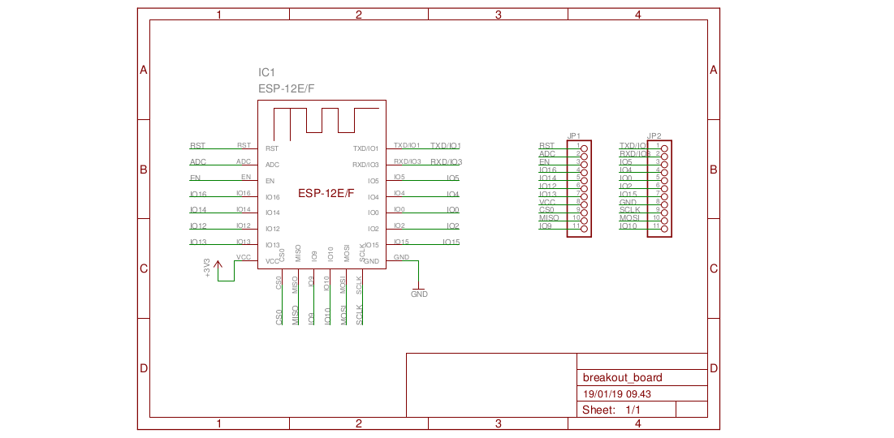

# ESP-12E/F Eagle Library
Eagle library for the barebone ESP-12E/F WiFi modules.
ESP-12E/F datasheet can be found on [from kloppenborg.net](https://www.kloppenborg.net/images/blog/esp8266/esp8266-esp12e-specs.pdf) or [from elecrow.com](https://www.elecrow.com/download/ESP-12F.pdf)

## Installation
### Linux
* `git clone https://github.com/handiko//ESP-12EF-Eagle-Library.git`
* `cd /ESP-12EF-Eagle-Library/lbr`
* Copy the `esp-12e-f.lbr` into your Eagle library folder. For example, if your eagle library folder is located in `/opt/eagle-7.2.0/lbr`, then type: `sudo cp esp-12e-f.lbr /opt/eagle-7.2.0/lbr`
* Open the Eagle CAD, then **Library ---> Use All**
* Now the pga103.lbr should be listed in your Eagle library.

### Windows
* Download as zip
* Unzip
* copy the `esp-12e-f.lbr` from **\ESP-12EF-Eagle-Library\lbr** into your Eagle library folder, for example : **C:\EAGLE-7.2.0\lbr**
* Open the Eagle CAD, then **Library --> Use All**

## Example
Breakout board, 22 pins, standard 0.1 inch pin connector, single layer top copper PCB.

## TODO
* Make a better example sch / board
* Adding description to the Device
* Better documentation / README
* ...

## Contributing
1. Fork it (https://github.com/handiko/ESP-12EF-Eagle-Library/fork)
2. Create new branch (`git checkout -b myfeature`)
3. Do some editing / create new feature
4. Commit your works (`git commit -m "Adding some myfeature blah blah blah.."`)
5. Push to the branch (`git push -u origin myfeature`)
6. Create a new Pull Request
